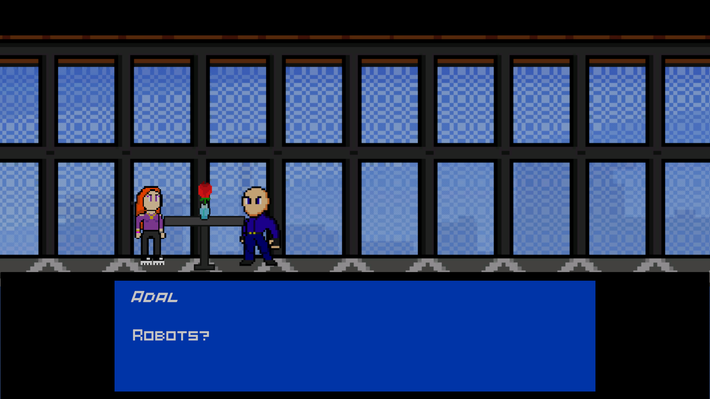
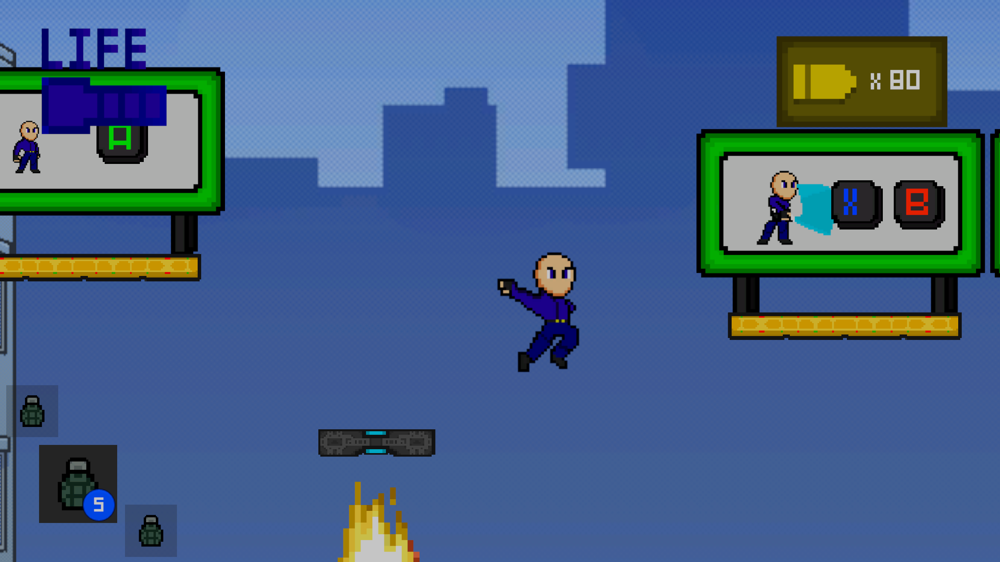
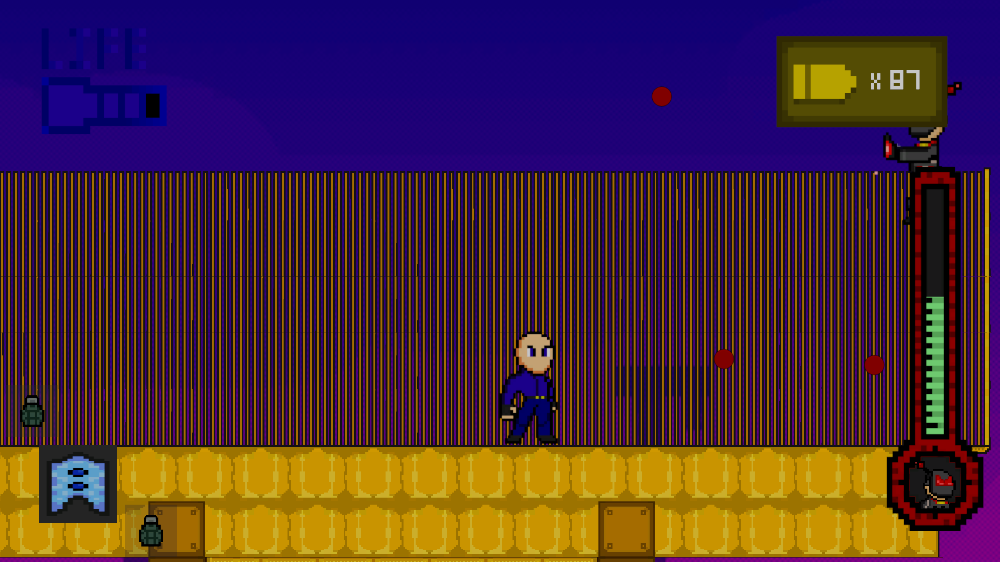
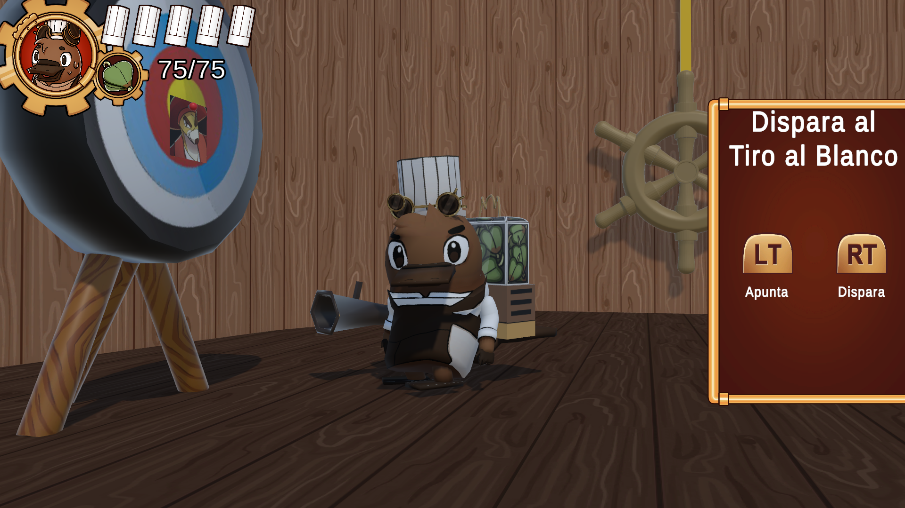
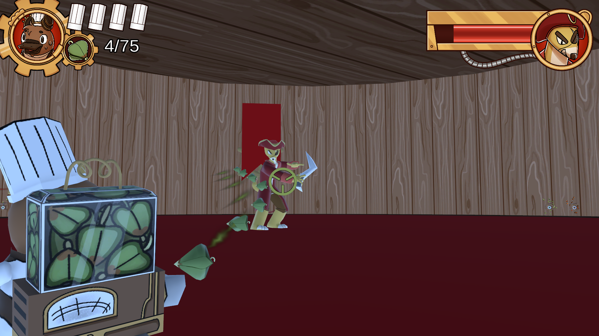
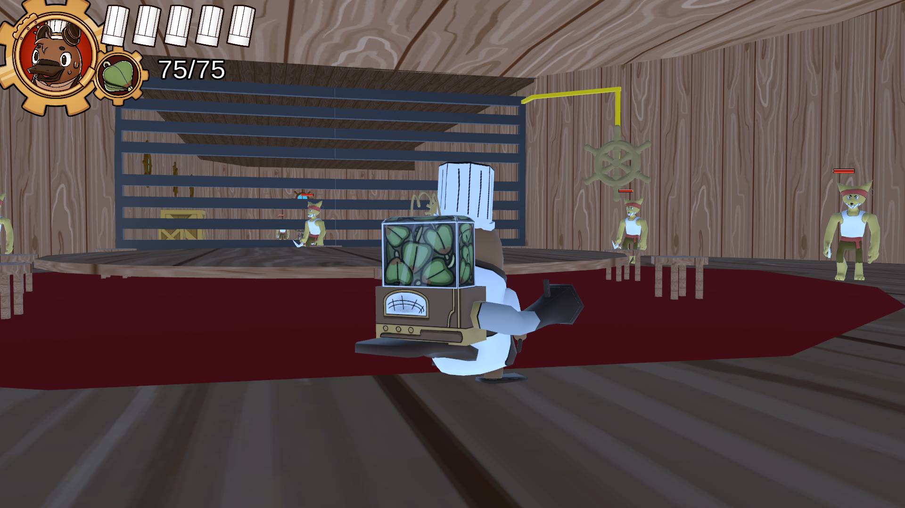
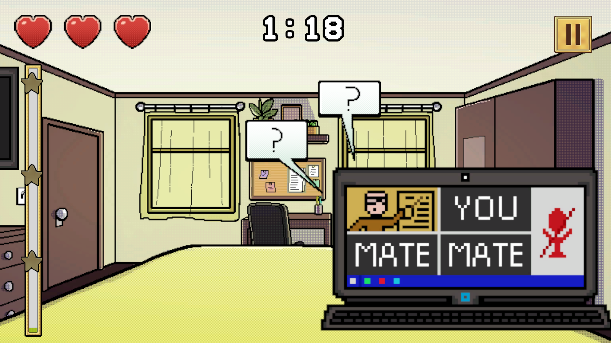
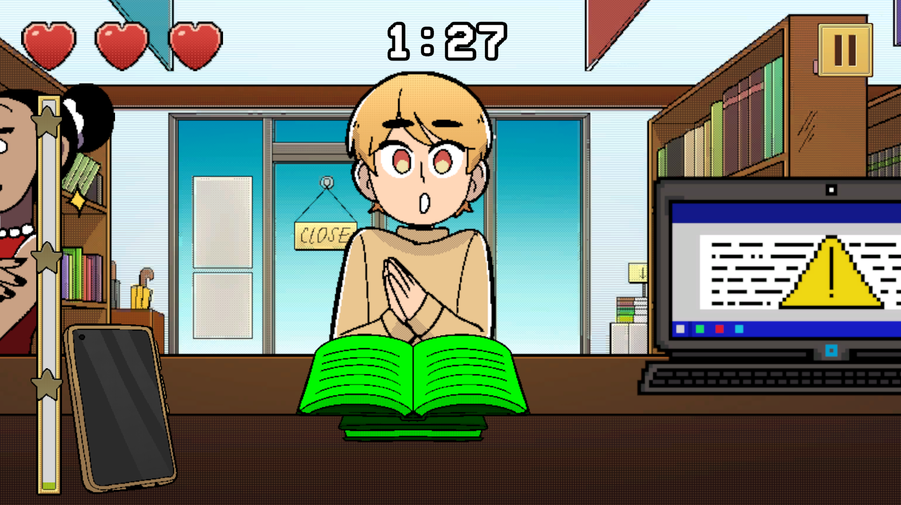
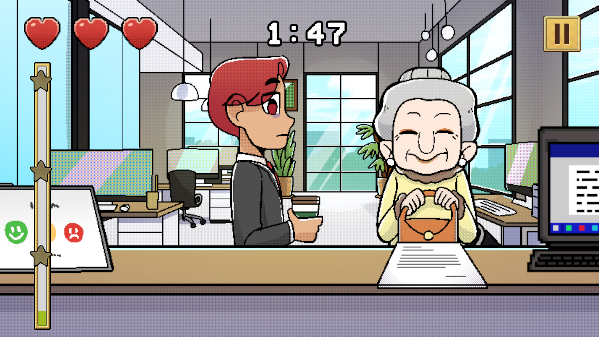

<h1 align="center">Hi, I'm Cristian Laynez 👋</h1>
<h3 align="center">Game Developer (Unity/C#) & Full-Stack Web Developer, from Guatemala 🇬🇹</h3>

Computer Science & IT Engineer building indie games under <strong>Goldenfy Studios</strong>, currently finishing a Master's in Video Game Design and Development.

 

## 🎮 Currently

- Finishing my **Master's Thesis (TFM)** on *Robotic Slaughter*, a 2D pixel art action-platformer.
- Working as a Full-Stack Developer at **Olive Tech GT**.
- Actively pursuing a career as a **Unity Game Developer**.

 

## 🕹️ Featured Projects

**[Robotic Slaughter](https://crislayb.itch.io/robotic-slaughter)** — 2D pixel art action-platformer built in Unity. Designed and implemented the core architecture, gameplay systems (including a two-phase boss with dynamic attack patterns), and narrative structure.

**Platyfa** — Custom Unity editor tools and modular gameplay systems built with ScriptableObjects.

**[Procrastinate](https://crislayb.itch.io/procrastinate)** — 2D point-and-click game with core interaction and logic systems.

👉 See more on my [Portfolio](https://crislayb.github.io/Portafolio_PW3/)

 

## 🛠️ Tech Stack

**Game Development**

**Web Development**

**Tools**

 

## 📫 Connect

**Portfolio:** [crislayb.github.io/Portafolio_PW3](https://crislayb.github.io/Portafolio_PW3/)

**Itch.io:** [crislayb.itch.io](https://crislayb.itch.io/)